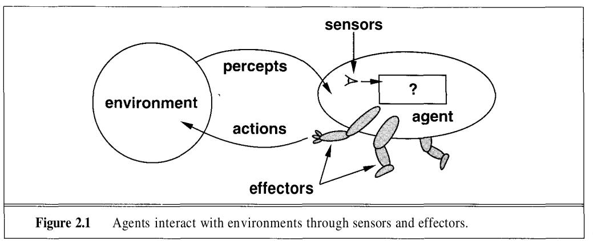
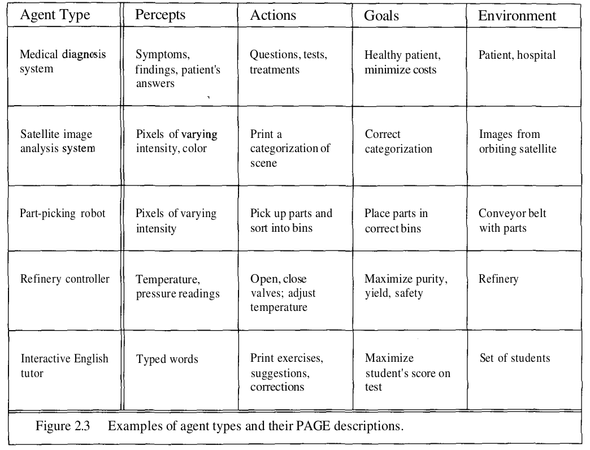
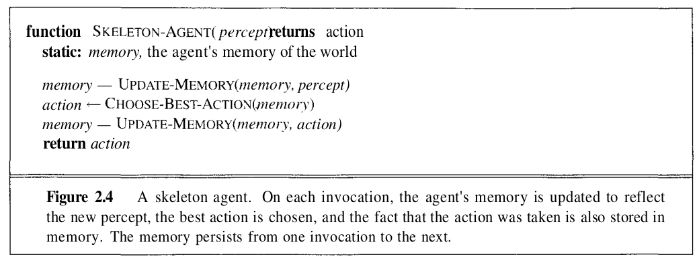

# Intelligent Agents
### In this chapter we discuss what an intelligent agent does, how it is related to its environment, how it is evaluated and how we might go about building one.

<br>

### Introduction
An agent is anything that perceives the environment using **sensors** and acts on it (the environment) using **effectors**.




### How agents should act
A rational agent is one that does the **right thing**. Obviously, this is better than doing the wrong thing, but what does it mean? As a first approximation, we will say that the right action is the one that will cause the agent to be most successful. That leaves us with the problem of deciding how and when to evaluate the agent's success.

We use the term **performance measure** as the term that decides how well the agent is doing its task. It's a measure of how successful it is. Subjective performance measures are very vague and difficult to answer, hence it is always better if we are able to define a more objective target for the agent.

The time at which we evaluate the performance of the agent also matters here. 

If we measured how much dirt the agent had cleaned up in the first hour of the day, we would be rewarding those agents that start fast (even if they do little or no work later on), and punishing those that work consistently. Thus, we want to measure performance over the long run, be it an eight-hour shift or a lifetime.


### Is this performance measure enough?
In most cases, no. It's not enough. But what does the question mean exactly?

Many a times, the intelligence of the agent is limited to its percepts and the inputs that are expected to be percieved by the agent. Sometimes a very weird input state might completely full the agent into taking an unexpected action.

This however is not neccessarily the agent's "fault" and the agent could still be said to be behaving "rationally"

### What defines an agent's rationality?
In short, what is rational at any point in time depends on 4 things:
1. The performance measure that defines degree of success.
2. Everything that the agent has perceived so far. We will call this complete perceptual history the **percept sequence**.
3. What the agent knows about the environment. (The degree of perception)
4. The actions that the agent can perform.

This leads to a definition of an **ideal rational agent**:
```
For each possible percept sequence, an ideal rational agent should do whatever action is expected to maximize its performance measure, on the basis of the evidence provided by the percept sequence and whatever built-in knowledge the agent has.
```

If you think about it, this definition of a rational agent may be counter-intuitive. This is because if we give limited percepts to an agent, it may be really really bad at a task, even while behaving like a "perfectly rational" ideal agent.

This means that for rationality to achieve true intelligence, we must provide the appropriate percepts, so the rational agent may also make intelligent descision.

<br>

### Mapping percept sequences to actions.
Once we realise that the rational action to be taken by the agent depends only on the percept sequence recieved so far, we realise that we might as well create a lookup table to map the percept sequences to actions.

**But, is this really feasible?**

We can see how, for most agents, this sequence can be infinitely long! This usually means that we would have to create a bound of the number of sequences to calculate.

Now we can map this percept sequence to actions that can be performed by the agent's effectors. This is called a **percept-to-action mapping**. In essence, if we have fixed sets of percepts and actions, we could say that:

```
An agent for this task, is described by its mapping.
```

And if a mapping describes an agent, then **ideal mappings** describe **ideal agents**.

This doesn't mean, of course, that we have to create a map of every possible percept sequence to action. Many agents can be described in much simpler terms, as we will see in this book.

<br>

### Autonomy
This is another point that an intelligent agent must satisfy. An agent's behaviour can be intelligent in 2 ways:

1. **It borrows intelligence:** For example, if a coder themselves writes the if-else statements of an agent. It is essentially borrowing the intelligence of the coder. It may still behave as a rational agent, but it uses **built-in** knowledge.
2. **It learns intelligence:** When the agent learns from experience, it may be said to be **learning** from the provided experience/data.

**Autonomy:** If a robot solely relies on its built-in knowledge to determine its actions, then it is said to **lack autonomy.**

```
A system is autonomous to the extent that its behavior is determined by its own experience.
```

Some degree of lack on autonomy is beneficial too, as it makes it easier to train the agent.


<br>
<br>

## The Structure of Intelligent Agents
So far we hae only talked about agents from a very blackbox point-of-view. For given percepts they perform a set of actions. However, we will now go deeper into the point of view of how these agents work.

There are 2 special terms that make up and agent:
1. **Program:** The main function that implements mapping percepts to actions. This is like the brain of the agent.
2. **Architecture:** The "body" of the agent, this is the part that runs the **program**, this might be a computer, an embedded device, or even a virtual environment inside a simulation software.

Thus,
```
Agent = Program + Architecture
```

The full definition of an agent requires the PAGE acronym

#### Percepts, Actions, Goals, Environments
Eg. 


The most famous artificial environment is the Turing Test environment, in which the whole point is that real and artificial agents are on equal footing, but the environment is challenging enough that it is very difficult for a software agent to do as well as a human.


### Agent Programs
Here we will see more about the kinds of agents based on the programs that are built into them. however, the original skeleton, of mapping percepts to actions will remain constant. Eahc will use some internal data structures that will be updated as new percepts arrive.

**Bascic Skeleton Agent**


One important thing to note is that