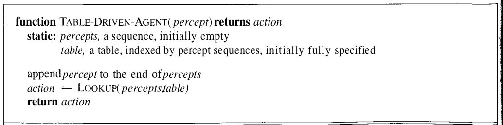
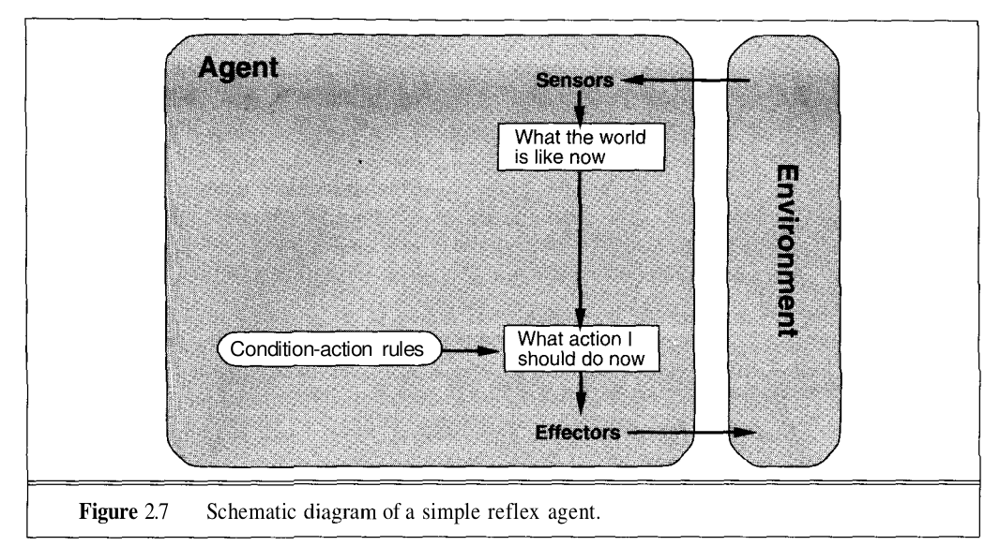
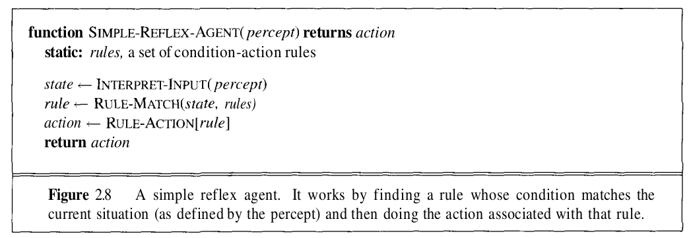
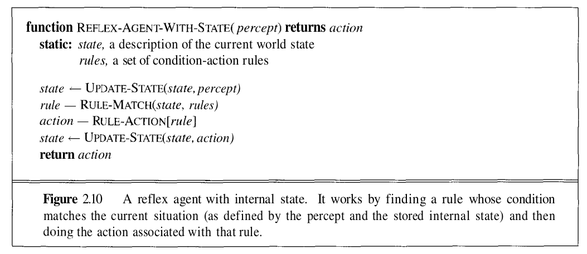
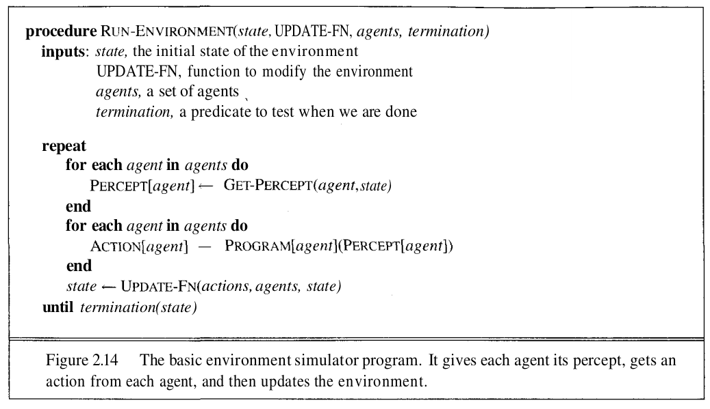
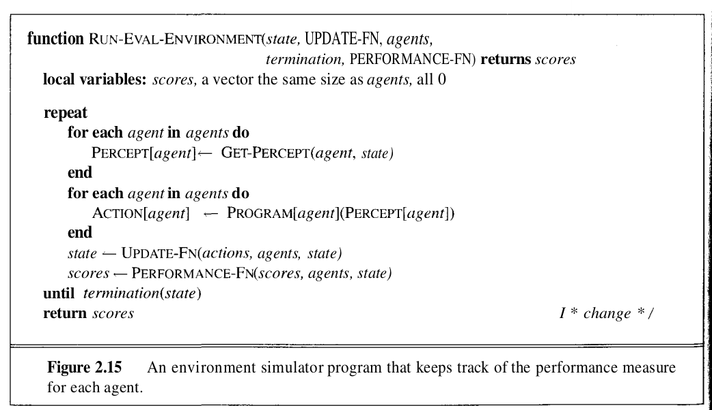

# Intelligent Agents
### In this chapter we discuss what an intelligent agent does, how it is related to its environment, how it is evaluated and how we might go about building one.

<br>

### Introduction
An agent is anything that perceives the environment using **sensors** and acts on it (the environment) using **effectors**.


### How agents should act
A rational agent is one that does the **right thing**. Obviously, this is better than doing the wrong thing, but what does it mean? As a first approximation, we will say that the right action is the one that will cause the agent to be most successful. That leaves us with the problem of deciding how and when to evaluate the agent's success.

We use the term **performance measure** as the term that decides how well the agent is doing its task. It's a measure of how successful it is. Subjective performance measures are very vague and difficult to answer, hence it is always better if we are able to define a more objective target for the agent.

The time at which we evaluate the performance of the agent also matters here. 

If we measured how much dirt the agent had cleaned up in the first hour of the day, we would be rewarding those agents that start fast (even if they do little or no work later on), and punishing those that work consistently. Thus, we want to measure performance over the long run, be it an eight-hour shift or a lifetime.


### Is this performance measure enough?
In most cases, no. It's not enough. But what does the question mean exactly?

Many a times, the intelligence of the agent is limited to its percepts and the inputs that are expected to be percieved by the agent. Sometimes a very weird input state might completely full the agent into taking an unexpected action.

This however is not neccessarily the agent's "fault" and the agent could still be said to be behaving "rationally"

### What defines an agent's rationality?
In short, what is rational at any point in time depends on 4 things:
1. The performance measure that defines degree of success.
2. Everything that the agent has perceived so far. We will call this complete perceptual history the **percept sequence**.
3. What the agent knows about the environment. (The degree of perception)
4. The actions that the agent can perform.

This leads to a definition of an **ideal rational agent**:
```
For each possible percept sequence, an ideal rational agent should do whatever action is expected to maximize its performance measure, on the basis of the evidence provided by the percept sequence and whatever built-in knowledge the agent has.
```

If you think about it, this definition of a rational agent may be counter-intuitive. This is because if we give limited percepts to an agent, it may be really really bad at a task, even while behaving like a "perfectly rational" ideal agent.

This means that for rationality to achieve true intelligence, we must provide the appropriate percepts, so the rational agent may also make intelligent descision.

<br>

### Mapping percept sequences to actions.
Once we realise that the rational action to be taken by the agent depends only on the percept sequence recieved so far, we realise that we might as well create a lookup table to map the percept sequences to actions.

**But, is this really feasible?**

We can see how, for most agents, this sequence can be infinitely long! This usually means that we would have to create a bound of the number of sequences to calculate.

Now we can map this percept sequence to actions that can be performed by the agent's effectors. This is called a **percept-to-action mapping**. In essence, if we have fixed sets of percepts and actions, we could say that:

```
An agent for this task, is described by its mapping.
```

And if a mapping describes an agent, then **ideal mappings** describe **ideal agents**.

This doesn't mean, of course, that we have to create a map of every possible percept sequence to action. Many agents can be described in much simpler terms, as we will see in this book.

<br>

### Autonomy
This is another point that an intelligent agent must satisfy. An agent's behaviour can be intelligent in 2 ways:

1. **It borrows intelligence:** For example, if a coder themselves writes the if-else statements of an agent. It is essentially borrowing the intelligence of the coder. It may still behave as a rational agent, but it uses **built-in** knowledge.
2. **It learns intelligence:** When the agent learns from experience, it may be said to be **learning** from the provided experience/data.

**Autonomy:** If a robot solely relies on its built-in knowledge to determine its actions, then it is said to **lack autonomy.**

```
A system is autonomous to the extent that its behavior is determined by its own experience.
```

Some degree of lack on autonomy is beneficial too, as it makes it easier to train the agent.


<br>
<br>

## The Structure of Intelligent Agents
So far we hae only talked about agents from a very blackbox point-of-view. For given percepts they perform a set of actions. However, we will now go deeper into the point of view of how these agents work.

There are 2 special terms that make up and agent:
1. **Program:** The main function that implements mapping percepts to actions. This is like the brain of the agent.
2. **Architecture:** The "body" of the agent, this is the part that runs the **program**, this might be a computer, an embedded device, or even a virtual environment inside a simulation software.

Thus,
```
Agent = Program + Architecture
```

The full definition of an agent requires the PAGE acronym

#### Percepts, Actions, Goals, Environments
Eg. 


The most famous artificial environment is the Turing Test environment, in which the whole point is that real and artificial agents are on equal footing, but the environment is challenging enough that it is very difficult for a software agent to do as well as a human.


### Agent Programs
Here we will see more about the kinds of agents based on the programs that are built into them. however, the original skeleton, of mapping percepts to actions will remain constant. Each will use some internal data structures that will be updated as new percepts arrive.

**Basic Skeleton Agent**


One important thing to note is that the goal/performance measure are is not part of the agent. This is because the performance measure is applied externally to judge the agent's behavious. It is often possible to achieve high performance without explicit knowledge of the performance measure.

**Table-Driven Agent**

Let us start with the simplest possible way to map percepts to actions - a lookup table.


If you think about it, it is doomed to fail:
- Even a moderately complex agent would require a **huuuge** table to stole the entire mapping.
- Training/Designing the table would be a whole different ball game.
- 0 autonomy as designer would have to build the table.
- Even if we gave it some degree of autonomy/ learning ability, it would be very difficult to train the agent/table.


So from the above discussion, we can conclude one thing, real world agents will have an added/removed level of complexity in its mechanism, the table doesn't always work. We will look at 4 real-world suited agent mechanisms that are not exactly "table-driven".

1. Simple Reflex Agents
2. Agents that keep track of the world
3. Goal-based Agents
4. Utility based agents


### Simple Reflex Agents
Since the option of creating an explicit table is out of the question, we can sometimes summarise the inputs the agent is getting and then make the agent act based on only this particular summary. This is like having a very conditional approach to the design of the agent, and is useful when designing triggers for various agents. For example, in the vacuum world if we know that there is dirt on the current square then the only logical thing to do will be suck the dirt, as it brings us closer to the goal.

Such triggers are also used in real life scenarios by AI agents, like if the car in front of you brakes suddenly, an self driving car will also have trigger that causes the braking of the self driving car.

We call such a connection a **condition-action rule**.

Such simple reflex agents ca be written very easily as we only have to define rules for such summaries, and that can be coded easily using a condition tree.






### Agents that keep track of the world
A simple reflex agent doesn't keep track of the world around it and responds only to the most recent percept. However this isn't ideal for every scenario. Taking the same example of a self-driving car, while having some conditional functionality it also needs to keep track of its surroundigs, just like a hukman driver would frequently look into the rear-viewing mirrors to keep track of the neighbouring cars.

We must now have some sort of internal state that the agent will update based on its percepts and memory.



### Goal based Agen
The above agent however cannot solve all the problems that have been put forward for it. A lot of times it is also looking for a particular configuration of the environment that is the solution of the puzzle/problem that it has been given.

Hence while searching through the possible environment configuations, it can also check if a particular configuation/state is a/the goal state.

Note the "a/the" in the previous line. There  may be multiple favourable goal states. Like the possible checkmates from a paritcular position in a game of chess.


### Utility based agents
The above conditions however do not satisfy all the possible problems that we have an AI. Apart from keeping track of the surroundings a lot of the times we may also have to keep a goal in mind that must be optimised in a way.

Again taking the idea of a self driving car, we might give it GPS coordinates to our location and then it must use traffic and geographic information to find the rout that takes the minimum time.

This is again an optmising problem, and to solve it we need some sort of heuristic to measure how far we are from the optimal position. The agent will then have a secondary objective to maximize/minimize the function together with solving the problem and finding the goal state.


## Environments
Apart from agents, in AI we also have a large number of types of environments that we will encounter. A few are listed below:

- Accessible or inaccessible
  - If the agent's sensors give it complete knowledge of the environment, then the environment is called accessible.
- Deterministic or non-deterministic
  - If the next state of the environment is completely determined by the current state of the environment + the action taken by the agent, then the environment is called deterministic.
  - If the final state depends in some other factors, or on a random probability distribution, then it is called non-deterministic environment.
- Episodic or non-episodic
  - If the agent's experience can be divided into fixed lengths of times, an "episode", then the environment is called episodic.
  - The experiences of an episode are independant on each other.
- Static or dynamic
  - If the environment state can change while the agent is calculating its next move then its called a dynamic environment.
- Discrete or continuous
  - If there are a limited discrete amount of percepts or actions that an agent can take then we say that the environment is discrete.
  - Eg. Chess, Go


We have now listed the kinds of environments that we can have. We now look at the way enivronments can work as testbeds to the agents we design.

### Environment programs

> One important thing to remember is that an environment might be responsible for handling a variety of agents inside it, it is not restricted to a single agent.

Imagine a simulator for a game playing agent, the environment in this case will take one or more agents as inputs and arranges to repeatedly give each agent the correct percept and take the action back from the agent.

You may want to either just run the environment or run it in a special evaluation mode. We have pseudocode for both situations.



