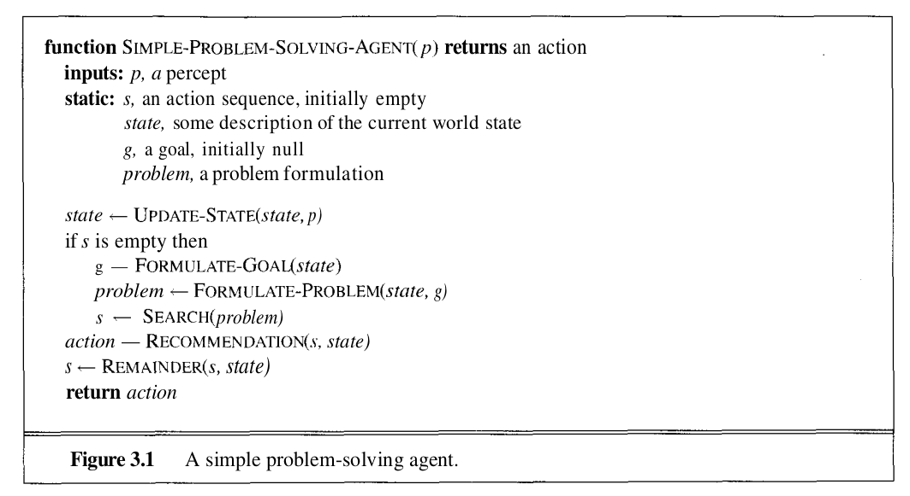
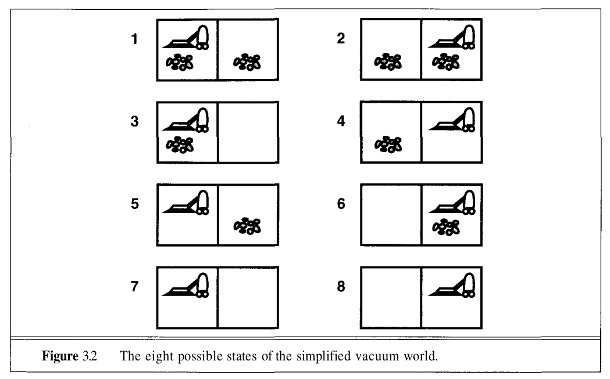
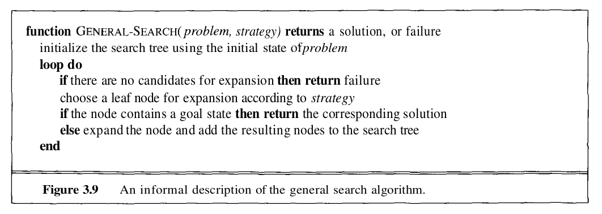
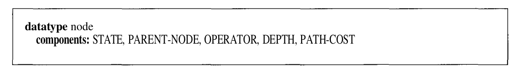
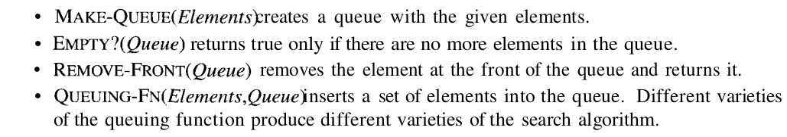
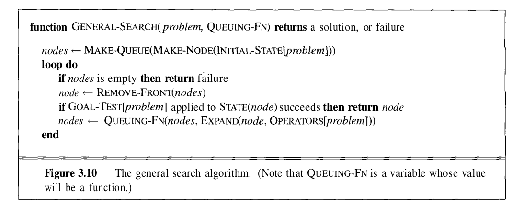

# Solving problems by searching
**In this chapter, we look at how an agent can search for the goal configurations of the environment systematically.**

In the previous chapter we have taken a look at simple reflex agents and how then can have conditional logic built into them.

In this chapter we look deeper into agents that can search through the possible states of the environments and then searh for a sequence of actions that leads to the completion or satisfaction of a particular goal. We call such agents *problem-solving agents*.

But for this to work out efficiently we must define the problem well and that leads to a straightforward search approach of the solution.

### The working of a simple problem-solving agent.
We now have to tell the agent to optimise its performance measure. But what are the various steps in defining such an agent and the related problem that we're trying to solve.
> At this pont it is important to state the difference between a goal and the perforance measure.

Taking an example from the book, we talk about a tourist with an expiring visa who has to end up at a city in a particular time limit. In this case the goal is  to always end up at that particular city. However in order to go there, we must also maximise the sightseeing he does on the way. So in this case reaching the final city is the **goal** and maximising fun and sightseeing on the way is the **perfomance measure**.

So the taks of a problem-solving agent is to achieve a particular goal while optimising its performance measure.

> The above discussion should also inform the reader about the difference between goal formulation and problem formulation.

Thus we have a *formulate, search and execute* model for our agent.

**Note:** Tyhis does not mean the agent stops once a goal is reached. Search methods can also be short term methods of finding a favourable state from which the agent will take other appropriate actions. Once the search solution is executed, the agent will find a new goal.

We will not discuss the UPDATE-STATE and FORMULATE-GOAL functions further in this chapter. The next two sections describe the process of problem formulation, and then the remainder of the chapter is devoted to various versions of the SEARCH function. The execution
phase is usually straightforward for a simple problem-solving agent: RECOMMENDATION just takes the first action in the sequence, and REMAINDER returns the rest.

### Formulating problems
In this section, we first explore the different amount of knowledge the agent can have about the environment it is currently in. We will also address some of the type of problems that we usually see.

### Vacuum world
This is one of the most basic problems in AI, and we will simplify it even further by considering only 2 tiles exist in the world. The vacuum cleaner is our agent and it can perform 3 actions only: Left, right, Suck.

The goal is to clean up all the dirt.

We have the following possible states and of that the goal states are {7,8}

We will now consider the inputs the vacuum cleaner could be getting as percepts.

1. First, suppose that the agent's sensors give it enough information to tell exactly which state it is in (i.e., the world is accessible); and suppose that it knows exactly what each of its actions
does. Then it can calculate exactly which state it will be in after any sequence of actions. For example, if its initial state is 5, then it can calculate that the action sequence [Right,Suck] will get
to a goal state. This is the simplest case, which we call a **single-state problem**.
2. Second, suppose that the agent knows all the effects of its actions, but has limited access to the world state. For example, in the extreme case, it may have no sensors at all. In that case, it knows only that its initial state is one of the set {1,2,3,4,5,6,7,8}. One might suppose that the agent's predicament is hopeless, but in fact it can do quite well. Because it knows what its actions do, it can, for example, calculate that the action Right will cause it to be in one of the states {2,4,6,8}. In fact, the agent can discover that the action sequence [Right,Suck,Left,Suck] is guaranteed to reach a goal state no matter what the start state. To summarize: when the world is not fully accessible, the agent must reason about sets of states that it might get to, rather than single states. We call this a **multiple-state problem**.
3. Unlike the above cases, a lot of the times, the robot cannot find a list fo actions that will guarantee the solving of a goal. It will have to rely on certain future percepts in order to decide what to do further. So it will have contingency plans and in such cases might even build a contingency tree that lists all the possible actions that might have to be taken based upon future percepts.
4. The final type of problem is when the agent has no knowledge of the consequences of the list of actions that it is provided. This is an **exploration problem**. In which, the agent will also have to explore and learn the consequences its actions.

### Defining problems and their solutions
A problem is essentially a collection of information that the agnet will use to decide what to do. We begin by specifying the information required to define a single state-problem.

1. The **initial state** of the environment.
2. The set of possible actions available to the agent along with a consequence function that tells us the possible final states of the environment when the agent performs a given action from a given starting state. This can be deterministic or even stochastic. An alternate way to put this is to define a successor function that takes in a particular state and an action and outputs the final stae of the environment after performing the action.
3. The goal test is a function that checks if a particular state is a goal state. Remember that there may be many goal states.
4. The path cost function, assigns a special cost to each path. In almost all cases, we consider the cost of the path to be the sum of the costs of the individual actions it takes.

Of the above list, 1 and 2 together form the state space of the problem, ie the set of all states that are reachable from the initial state.

Together, the initial state, successor function, goal test, and path cost define a problem.

> Coding tip: A problem can be represented with a class containting the four above.

So far we have only dealt wit h single state systems, but to deal with multiple state problems we only need to make a minor modification. Now instead of dealing with single states at the end of operators, we will now have sets of states. And to expand a given set of states that we might possibly be in, we only grow the number of states that we might be in by takingg the uniion of the outputs of the successor function for each possible input state.

### Measuring problem solving effectiveness
Problem solving usually should require a healthy mix of planning and execution. So we have 2 types of costs associated over here.

- **The search cost**: The cost associated with planning ahead, or actually searching through the required time. This is the cost associated with the planning of the next move.
- **The execution cost**: This refers to the what we are actually optimizing against. ths is the cost of the actual paths the agent will take in the action that it performs.

**The book now contains many example problems, pls refer the same from the book.**

## Searching Techniques
We have now seen how to define a problem,  and how to recognize a goal state. The remaining part of finding a solution path is done by searching through the goal space. The idea is to maintain and extend a set of partial solution sequences. In this section, we see how to generate such solutions and how to keep track of the partial solutions using data structures.

### Generating action sequences
We generate action sequences by maintaining a set of states that we are currently going to look at.

This can be thought of as a tree that we expand over the state space. Even if the state space may be unlimited, the search tree will only be bounded (when we use the appropriate search strategy). So at the beginning, we hav3 only one state ( the initial state) in the set of states we are currently observing.

Then we need to **generate** more states from the states that we already have. This needs some sort of generating function, that we have defined earlier in the problem-formulation section of thisd chapter.

So we first select a state from the set of states that we are currently exploring, then use the generating function to expand that particular state so we can further increase the span of the search tree. So at each step we are expanding one leaf node of the search tree that was superimposed on the search space.

### Nodes vs States (Practical coding)
At this point we need to remember that for practical purposes, the nodes of the search tree will not simply be the states of the problem. We need to save some metadata in order to efficiently find the path that was taken to a particular node.

The various components that it will have are:
- the state in the state space to which the node corresponds;
- the node in the search tree that generated this node (this is called the parent node);
- the operator that was applied to generate the node;
- the number of nodes on the path from the root to this node (the depth of the node);
- the path cost of the path from the initial state to the node.

Thus the node data type is like:

It is important to remember the distinction between nodes and states. A node is a bookkeeping data structure used to represent the search tree for a particular problem instance as generated by a particular algorithm. A state represents a configuration (or set of configurations) of the world.

Thus, nodes have depths and parents, whereas states do not. (Furthermore, it is quite possible for two different nodes to contain the same state, if that state is generated via two different sequences
of actions.) The EXPAND function is responsible for calculating each of the components of the nodes it generates.

We ideally expect to use a set of states to maintain the list of states that are currently waiting to be expanded. This is called the **frontier** or the **fringe**. It would be computationally very expensive to go through every node in the set before expanding the node. We maintain a **queue** of nodes that are expanded in the order they were added, or in a particular priority (We will see this later).

The **queue** we saw earlier is has an interface as shown below:

Thus the searching pseudocode is as shown below:

### Search Strategies
We now look at search stragies, that are responsible for picking which state we will explore next.

We will evaluate these search strategies on the 4 criteria below:
- **Completeness**: Whether a solution is guaranteed when there is one.
- **Time complexity**: How long does it take to find a solution?
- **Space complexity**: how much memory is needed to perform the search.
- **Optimality**: Does the strategy find the highest quality solution path?

This chapter covers six search strategies that come under the heading of uninformed search. The term means that they have no information about the number of steps or the path cost from the current state to the goal—all they can do is distinguish a goal state from a nongoal state. Uninformed search is also sometimes called blind search.

Apart from blind search, we also might have the possiblity of a search that favours certain states over other. This will need some sort of **heuristic** to compare states with each other. Search strategies that make use of this information will be discussed in the next chapter.

The 6 uninformed search strategies that we will learn in this chapter will be distinguished by the order in which the nodes are expanded.

### Breadth First Search
In this search strategy, we use a simple queue to decide the order of the nodes in which they will be expanded. Once a node is expanded, its children will be enqueued.

So, in general, all nodes at depth d are expanded before the nodes at depth d+1.

- [x] Complete?
- [ ] Optimal?

BFS is optimal only when the path cost is a non-decreasing function of the depth of the node. Which means, it is optimal when we only care about the number of actions we have to take in order to reach a node ( which is actually the case in many problems :P ).